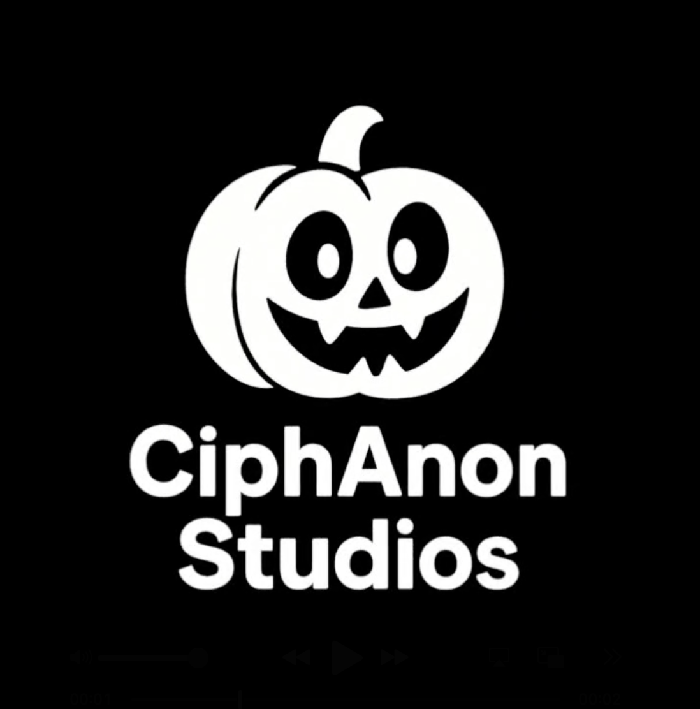

# 🎮 [GAME NAME]

## ✨ About the Game

[Write a short, exciting paragraph here that describes your game. What is the core loop? What makes it fun? What problem or itch does it scratch? What is your motivation for making it?]

**[YOUR GAME NAME]** is a [browser-based] [battle royal game] game based off of Brawl Stars where you []. Created with [technologies used, e.g., HTML, CSS, JavaScript], this project aims to [your project goal, e.g., practice web development, create a fun, nostalgic experience].

## 🕹️ How to Play

[Provide a simple, quick guide on how to get started. Assume the user has no prior knowledge of your game.]

1.  **Access the game**: Open `index.html` in your web browser.
2.  **Start the video**: If the intro video does not play automatically due to browser restrictions, simply click the screen.
3.  **Controls**:
    *   `[KEY]` - [Action]
    *   `[KEY]` - [Action]
    *   `[KEY]` - [Action]

## 🖼️ Visuals

[A picture is worth a thousand words! Use this section to showcase your game with screenshots or a GIF. This is one of the most effective ways to communicate what your game is about.]

_A captivating moment from the game._

_Showcasing another cool feature or level._

## 🛠️ Technologies Used

[List the technologies that power your game. This is especially useful for showing off your technical skills to potential collaborators or employers.]

*   **HTML5**: For the game structure and splash screen.
*   **CSS3**: For styling, animations, and the loading bar.
*   **JavaScript (ES6+)**: For the game's logic and interactive elements.

## 👥 Authors

[Credit yourself and any other team members. Link to your GitHub profiles or portfolios.]

*   **[CiphAnon Studios]** - [Studio Group] - [GitHub Profile](https://github.com/[your-github-handle])
*   **[ToonyTime]** - [Owner] - [GitHub Profile](https://github.com/[their-github-handle])
*   *   **[BlockersGotBugsFr.Alt]** - [Alt Account used at school] - [GitHub Profile](https://github.com/[their-github-handle])

## 🤝 Contributing

[If you are open to contributions, include a brief note on how to get involved. If not, you can skip this section.]

Want to help make this game even better? We'd love your input! Feel free to:
*   **Open an issue** to report a bug or suggest a new feature.
*   **Submit a pull request** with your improvements to the code.

## 📝 License

This project is licensed under the [MIT License] - see the `LICENSE` file for details.

## 🙏 Acknowledgments

[This is a great place to thank anyone who helped you or inspired your project.]

*   Inspiration for this project came from supercell.com.
